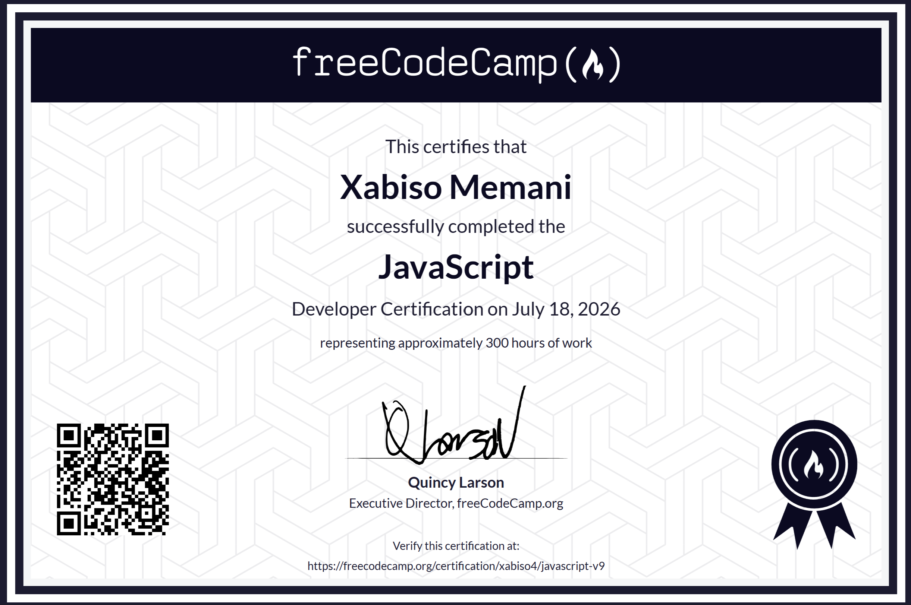

# FreeCodeCamp — JavaScript Algorithms and Data Structures (v9)

I completed the [JavaScript Algorithms and Data Structures v9](https://www.freecodecamp.org/learn/javascript-v9/) certification on freeCodeCamp. This repo holds the five required projects from that curriculum.

**Certificate:** [javascript-v9 — xabiso4](https://www.freecodecamp.org/certification/xabiso4/javascript-v9)

The purpose of going through this was to sharpen my JavaScript skills. All the code is written by me — working through **1319 tasks** across 30+ modules covering variables, functions, arrays, objects, loops, DOM, regex, form validation, audio and video events, Maps and Sets, classes, recursion, data structures, algorithms, graphs and trees, functional programming, and asynchronous JavaScript. Building these projects and earning the certificate has made me a lot more confident with JavaScript, and more confident in my problems solving skills.

## Projects

| #   | Project                                                        | What it covers                  | Live demo                                                                                                                       |
| --- | -------------------------------------------------------------- | ------------------------------- | ------------------------------------------------------------------------------------------------------------------------------- |
| 1   | [Markdown to HTML Converter](./01-markdown-to-html-converter/) | Regex, input events, DOM        | [View](https://xabisomemani.github.io/FreeCodeCamp-JavaScript-Algorithms-and-Data-Structures-v9/01-markdown-to-html-converter/) |
| 2   | [Drum Machine](./02-drum-machine/)                             | Audio API, keyboard events, DOM | [View](https://xabisomemani.github.io/FreeCodeCamp-JavaScript-Algorithms-and-Data-Structures-v9/02-drum-machine/)               |
| 3   | [Voting System](./03-voting-system/)                           | Map, Set, functions             | Code only                                                                                                                       |
| 4   | [Bank Account Manager](./04-bank-account-manager/)             | Classes, OOP, arrays            | Code only                                                                                                                       |
| 5   | [Weather App](./05-weather-app/)                               | Fetch, async/await, APIs        | [View](https://xabisomemani.github.io/FreeCodeCamp-JavaScript-Algorithms-and-Data-Structures-v9/05-weather-app/)                |

Markdown Converter, Drum Machine, and Weather App have HTML so those are on GitHub Pages. Voting System and Bank Account are pure JS — no UI to deploy — so the READMEs in those folders explain how they work.

## Tech

JavaScript (ES6+), HTML5, CSS3

**Xabiso Memani** — [Portfolio](https://xabiso.vercel.app) · [LinkedIn](https://linkedin.com/in/xabiso)
